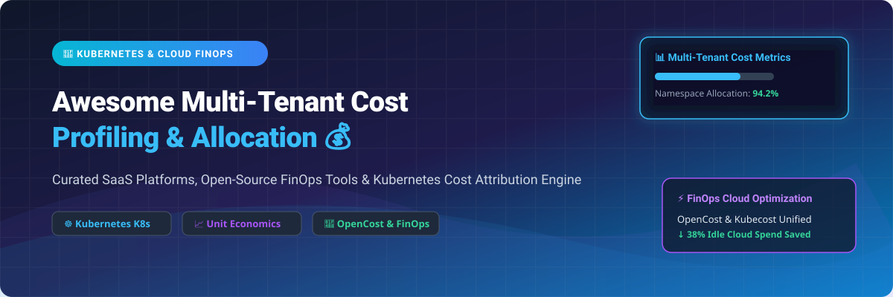

  
  
  
  
  
  

  

# 💰 Awesome Multi-Tenant Cost Profiling & Allocation 🚀

> **A curated collection of top SaaS products, open-source FinOps tools, and cloud infrastructure platforms for Kubernetes multi-tenant cost tracking, spend attribution, unit economics, and automated cloud optimization.**

---

## 📌 Executive Overview & SEO Index

In modern cloud-native architectures, multi-tenant infrastructure (particularly shared **Kubernetes (K8s)** clusters, shared serverless workloads, microservices, and multi-tenant databases) makes cost attribution exceptionally difficult. **Multi-Tenant Cost Profiling & Allocation** solves this challenge by mapping granular cloud usage (CPU, RAM, GPU, storage, egress, network traffic) directly to business dimensions such as **tenants, customers, teams, products, environments, or namespaces**.

This repository provides an authoritative guide comparing **commercial SaaS FinOps platforms** and **production-ready Open-Source GitHub tools** to help platform engineers, DevOps leads, and FinOps practitioners achieve enterprise cloud transparency.

---

## 🗺️ Table of Contents

- [📊 SaaS Platforms Comparison](#-saas-platforms-comparison)
- [🛠️ Open-Source FinOps Projects](#️-open-source-finops-projects)
- [💡 Architectural Best Practices](#-architectural-best-practices)
- [🤝 How to Contribute](#-how-to-contribute)
- [💖 Support & Buy Me A Coffee](#-support--buy-me-a-coffee)
- [📜 Disclaimer](#-disclaimer)
- [⭐ Star History](#-star-history)

---

## 📊 SaaS Platforms Comparison

> 📊 **Sector Market Analysis**: The global Cloud FinOps and Multi-Tenant Cost Profiling market is estimated at **$18.4 Billion by 2026** (growing at a 22.4% CAGR from ~$8.3B in 2022). The sector is **moderately fragmented** with strong consolidation activity by enterprise tech giants (e.g., IBM acquiring Apptio/Cloudability & Kubecost), alongside hyper-specialized category leaders (Cast AI, CloudZero, Vantage, Finout) competing on real-time Kubernetes unit economics and automated savings.

The table below summarizes leading commercial platforms, **sorted by Company Size / Valuation (Descending)**:

| 🏢 Product Name | 📝 Description & Key Features | 💳 Pricing Tiers (Starting Price) | 🎁 Free Tier / Trial Limits | 📈 Company Size / Valuation |
| :--- | :--- | :--- | :--- | :--- |
| **[Cloudability](https://www.apptio.com/products/cloudability/)** *(Apptio / IBM)* | 🏛️ Enterprise multi-cloud FinOps governance, cost allocation, and financial planning across AWS, Azure, GCP, and container clusters. | **$499/month** (Starter tier based on monitored cloud spend) | 🎁 **14-Day Free Trial** with full AWS/Azure/GCP cost allocation reporting | 🚀 **$4.6B Acquisition** *(by IBM; IBM $200B+ Market Cap)* |
| **[Kubecost Enterprise](https://www.kubecost.com/)** *(IBM)* | ☸️ The commercial extension of OpenCost. Unified multi-cluster federation, ETL backup, Prometheus-less agent, and RBAC cost governance. | **$8.00/node/month** (or $499/mo Pro Tier) | 🎁 **Free-Forever Foundations Tier** (Unlimited clusters up to 250 cores, 15-day metric retention) | 🏢 **Acquired by IBM** *(IBM $200B+ Market Cap; $100M prior valuation)* |
| **[Harness Cloud Cost Management](https://www.harness.io/products/cloud-cost-management)** | ⚡ End-to-end software delivery & cost management platform. Includes idle resource AutoStopping and container cost recommendations. | **$2.25/node/month** (or $25/month per 100 workloads) | 🎁 **Free-Forever Plan** (Up to $250k/year managed spend, 2 K8s clusters, 10 AutoStopping rules, 30-day retention) | 🦄 **$3.7B Valuation** *($425M total funding, $100M+ ARR)* |
| **[Cast AI](https://cast.ai/)** | 🤖 Automated Kubernetes compute rightsizing, spot instance orchestration, GPU management, and real-time cost profiling. | **$0.005/node-hour** (or 25% of guaranteed cloud savings) | 🎁 **Free-Forever Read-Only Cluster Audit** & 14-day full auto-optimization trial | 🦄 **$1.0B+ Valuation** *(Unicorn status, $108M Series C funding)* |
| **[CloudZero](https://www.cloudzero.com/)** | 🧠 Cloud cost intelligence platform. Maps code changes, Datadog, Snowflake, OpenAI, & AWS usage to tenant unit economics and telemetry. | **~1.9% of monitored spend** (min. $2,500/mo annualized subscription) | 🎁 **30-Day Proof-of-Concept (POC)** trial with full cost attribution audit | 💰 **$119M Total Funding** *(Series C, ~$25M EST. Revenue)* |
| **[Finout](https://www.finout.io/)** | 📦 "MegaBill" platform unifying AWS, K8s, Datadog, Snowflake, & OpenAI into unified tenant unit economics without agent installation. | **$500/month** (Fixed annual tier billing based on spend range) | 🎁 **14-Day Free Trial** (Up to $50,000 monthly spend analysis) | 💰 **$85M Total Funding** *(Series C, ~$9.1M EST. Revenue)* |
| **[Vantage](https://www.vantage.sh/)** | 👁️ Developer-centric cloud cost transparency platform with Autopilot savings, per-tenant K8s cost allocation, and custom dashboards. | **$30.00/month** (Pro Plan for up to $7,500 monthly spend) | 🎁 **Free Starter Plan** (Free forever up to $2,500 tracked monthly cloud spend) | 💵 **$50M–$100M Valuation** *($25M funding, ~$17.9M EST. Revenue)* |
| **[Anodot](https://www.anodot.com/cloud-cost-management/)** *(Glassbox)* | 🔔 AI-driven cloud cost anomaly detection, automated tenant cost allocation, and unit metric telemetry. | **$350/month** (Base tier for real-time cost anomaly tracking) | 🎁 **14-Day Proof-of-Concept (POC)** pilot with up to $25,000 cloud spend | 🏢 **Acquired by Glassbox** *($65M+ funding, ~$13.8M EST. Revenue)* |

---

## 🛠️ Open-Source FinOps Projects

> 🌟 **Community-Driven Cloud Transparency**: Open-source solutions provide robust production-grade foundations for Kubernetes cost allocation, infrastructure drift prevention, and cluster autoscaling.

Below is the list of top open-source projects, **sorted by GitHub Stars_Count (Descending)**:

| 📦 Repository & Link | ⭐ Stars_Count | 📝 Description & Ecosystem Role | 🛠️ Tech Stack |
| :--- | :--- | :--- | :--- |
| **[Infracost](https://github.com/infracost/infracost)** |  | 🏗️ **Cloud cost estimates for Terraform & IaC** in pull requests before deployment. Prevents unexpected cloud bill spikes. | `Go` `Terraform` |
| **[OpenCost](https://github.com/opencost/opencost)** |  | ☸️ **CNCF specification & reference implementation** for Kubernetes cost allocation by cluster, namespace, pod, or custom tenant label. | `Go` `Prometheus` |
| **[Cloud Custodian](https://github.com/cloud-custodian/cloud-custodian)** |  | 🛡️ **Rules engine for cloud security, governance & cost optimization**. Automates resource cleanup & off-hours shutdown. | `Python` `YAML` |
| **[Komiser](https://github.com/mlabouardy/komiser)** |  | 🌐 **Cloud environment inspector & cost audit engine**. Unifies AWS, GCP, Azure, and DigitalOcean resource allocation. | `Go` `React` |
| **[Goldilocks](https://github.com/FairwindsOps/goldilocks)** |  | 📏 **Kubernetes resource recommendation engine**. Identifies over-provisioned container requests & limits to optimize cluster efficiency. | `Go` `Kubernetes` |
| **[Kube Capacity](https://github.com/robscott/kube-capacity)** |  | 📊 **CLI tool providing a simple overview of resource requests, limits, and utilization** across Kubernetes nodes & pods. | `Go` `CLI` |
| **[AutoSpotting](https://github.com/LeanerCloud/AutoSpotting)** |  | ⚡ **Automates replacing AWS AutoScaling EC2 instances with spot instances** in existing deployment groups with minimal downtime. | `Go` `AWS` |
| **[Karpenter](https://github.com/kubernetes-sigs/karpenter)** |  | 🚀 **Next-generation Kubernetes node autoscaler**. Rapidly provisions right-sized nodes to minimize idle compute spend. | `Go` `Kubernetes` |
| **[kubectl-cost](https://github.com/kubecost/kubectl-cost)** |  | 💻 **kubectl plugin for real-time Kubernetes cost allocation metrics** directly from the terminal via OpenCost APIs. | `Go` `Kubernetes` |
| **[Kubecost Helm Chart](https://github.com/kubecost/kubecost)** |  | 📦 **Deployment chart for Kubecost Free Tier**. Provides single-cluster visibility, alerts, and cost optimization dashboards. | `Helm` `Kubernetes` |
| **[Kube Downscaler](https://github.com/hjacobs/kube-downscaler)** |  | 🌙 **Automatically scales down Kubernetes deployments & statefulsets** during non-working hours to reduce dev/staging cloud costs. | `Python` `Kubernetes` |

---

## 💡 Architectural Best Practices

When building custom multi-tenant cost profiling and allocation engines, consider the following blueprint:

1. **Namespace & Label Tagging Standard**: Enforce strict Kubernetes metadata annotations (`tenant`, `environment`, `team`, `cost-center`).
2. **OpenCost Core Engine**: Deploy [OpenCost](https://github.com/opencost/opencost) into your Kubernetes control plane for node, pod, and PVC cost allocation.
3. **Cloud Provider Billing Ingestion**: Correlate OpenCost telemetry with AWS CUR (Cost & Usage Reports), GCP Billing Export, or Azure Cost Management APIs.
4. **Unit Economics Telemetry**: Combine total tenant monthly cloud spend with business metrics (e.g., active daily users, API requests, database transactions) to calculate cost per customer.

---

## 🤝 How to Contribute

Contributions are warmly welcomed! 

1. **Fork the repository** 🍴
2. Create your feature branch (`git checkout -b feature/new-finops-tool`)
3. Commit your changes with clear descriptions 📝
4. Open a **Pull Request** 🚀

Please ensure all added SaaS tools include verified pricing tiers, free trial details, and company sizing, while open-source additions include Stars_Badges linked to stargazers.

---

## 💖 Support & Buy Me A Coffee

Thank you for exploring **Awesome-Multi-Tenant-Cost-Profiling-Allocation**! If you find this curated ecosystem list valuable:

- ⭐ **Star** this repository to support its visibility!
- 🍴 **Fork** and contribute new tools or updates!
- 📢 **Share** it with your FinOps, DevOps, and Platform Engineering teams!

If you'd like to support ongoing updates and maintenance, consider sponsoring:

---

## 📜 Disclaimer

- **Community Curated**: This list is curated by community contributors for educational & architectural evaluation purposes.
- **Data Accuracy**: Pricing and company valuations fluctuate; figures are based on published pricing pages and public funding data as of October 2026.
- **Security & Compliance**: Ensure self-hosted cost profiling infrastructure enforces proper RBAC, network policies, and credential security.

---

## ⭐ Star History

---

  <b>Made with ❤️ for Platform Engineers, FinOps Practitioners & Cloud Architects worldwide.</b>

